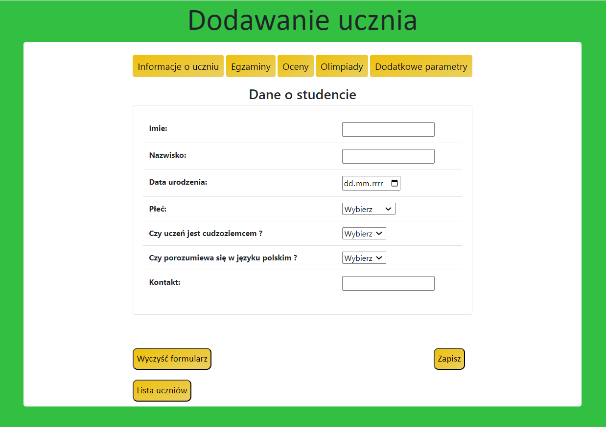
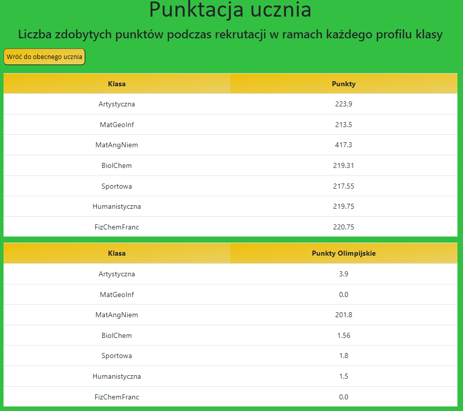
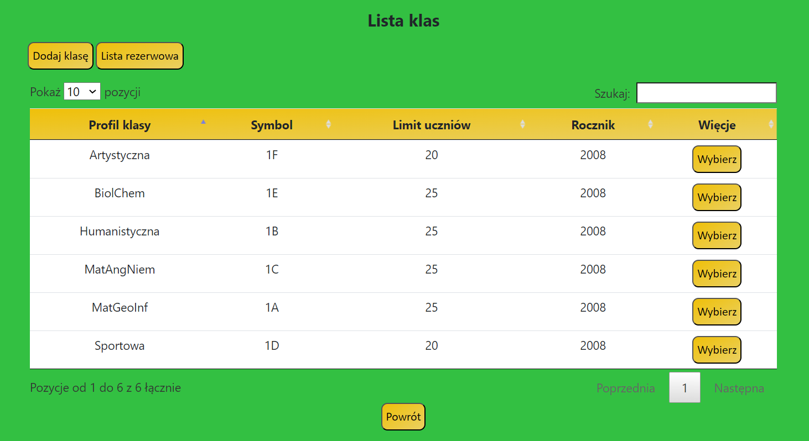
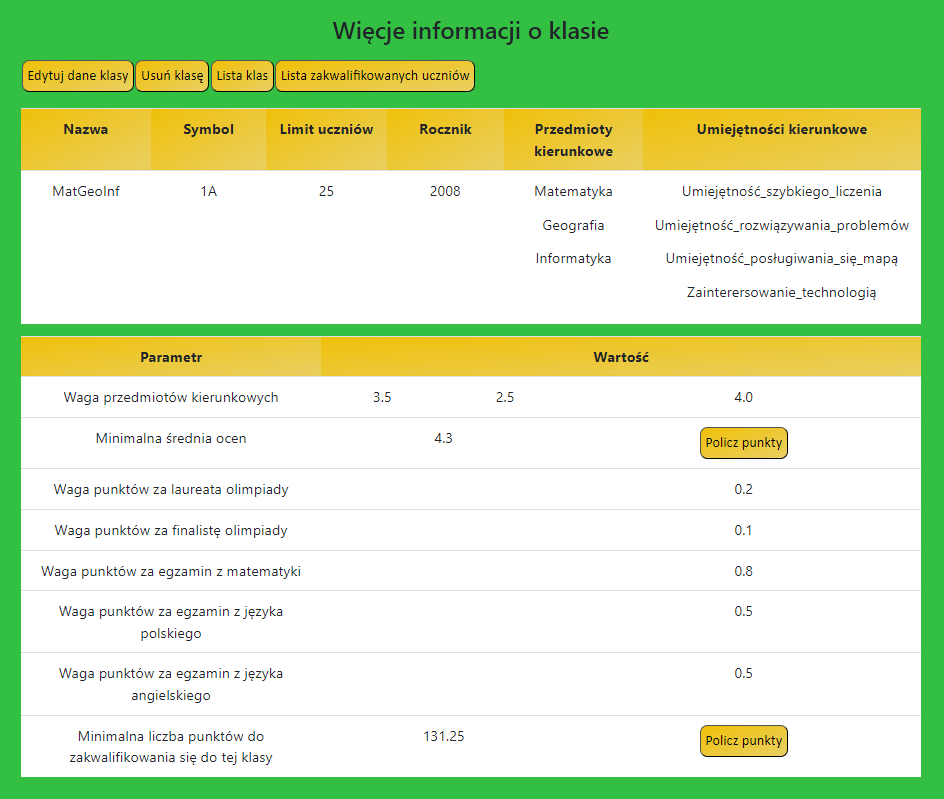
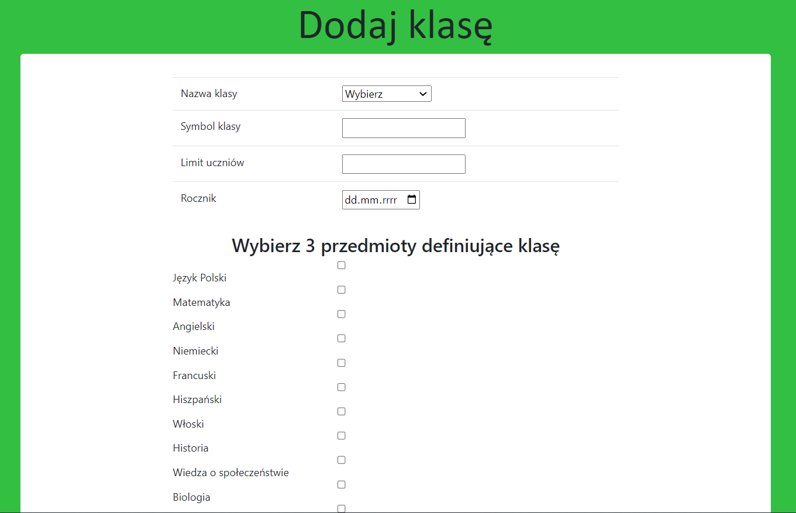
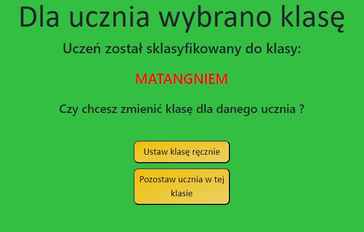
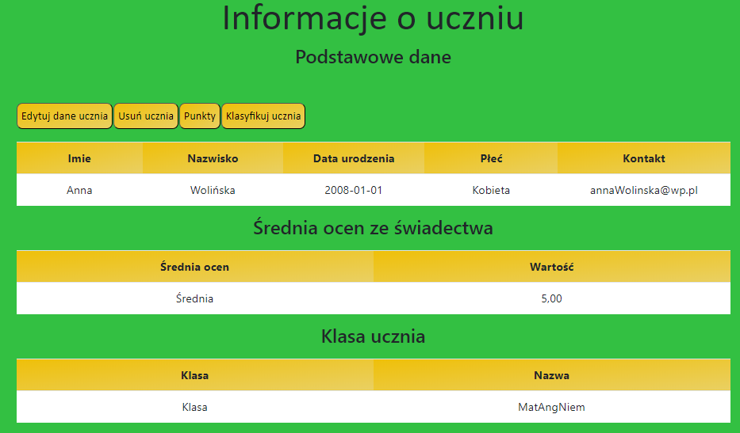
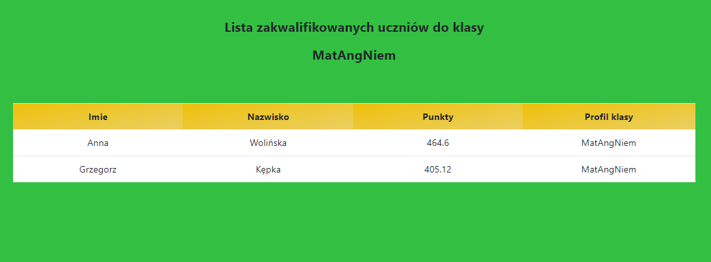

# Application to support school recruitment

## PURPOSE OF THE APPLICATION

The purpose and goal of the application is to carry out the classification of individual students into
classes with specific profiles. This classification is carried out on the basis of the set parameters.

### Technologies

The described student classification system is a web application, which is used with the help of a browser window.
The application is based on a backend layer and a frontend layer. The layer beckend layer was written in Java using frameworks such as Spring Boot
and Hibernate, as well as using the Thymeleaf template engine . The frontend uses HTML and CSS language with Bootstrap elements.
In the case of data validation, code fragments based on JavaScript were introduced into the application. The application uses a relational database,
which is managed by the PostgreSQL system.

### Sign up and sign in

After creating an account and correctly logging in, the user's eyes are shown the main panel, which presents the list of students already in the system.
This panel also allows the user to to perform operations such as adding a student, checking detailed information about a given student or displaying a
list of classes student or displaying the list of classes.

### New student

When adding a new student to the recruitment system, we include such information as: basic data (including name, surname, date of birth),
exam results, certificate grades, results of olympiads, and additional parameters in the form of predispositions and skills, which are the result of tests conducted at an earlier stage of recruitment.

### Scoring system

For each student, we calculate the number of points he/she scored during recruitment.

### Class

After going to the list of classes, we have the option to add a class, check the details of each class, and as well as navigate to the student reserve list. In the detailed panel of each class have been displayed the parameters of the class, which, among other things, will be used for the later classification of students.

 

### New class

the quantity of students, as well as three directional subjects. In the detailed panel, we complete directional skills and parameters for the class.

### CLASSIFICATION

The ability to classify provides us with a detailed student panel. Classification is available after
entering all the necessary information such as the student's points and detailed parameters of the class. After the initial classification,
you will be asked if you are sure you want the student to be classified in this particular class. If so, it leaves the student in the proposed
by the algorithm or changes the class manually. The classification result will be reflected on the
detailed panel of each student.

 

### LIST OF QUALIFIED STUDENTS

After classification, the student will also be included in the list of students in a class with a specific profile.

### DATABASE CONFIGURATION

In the application.yml file, which is located in the main->resources folder, enter the following information,
in order to correctly perform the database configuration:
password:
url:
username:

